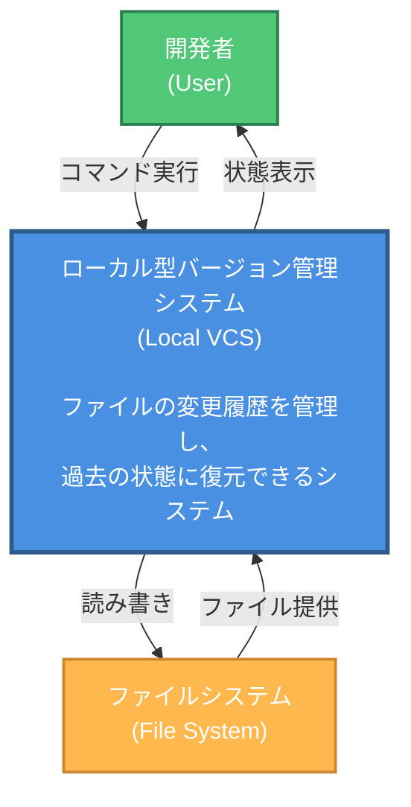
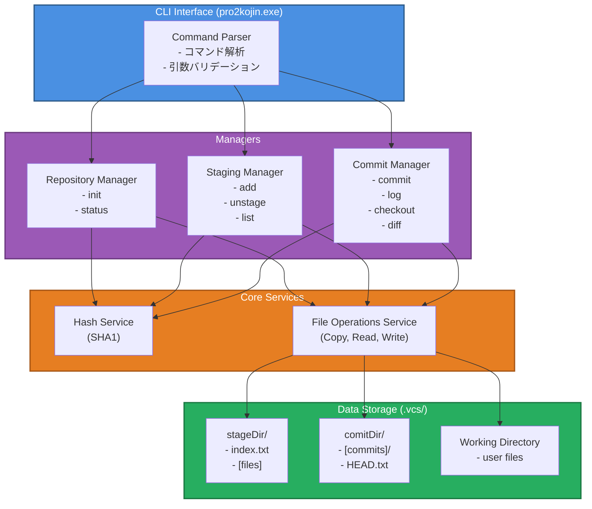
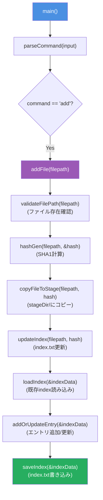
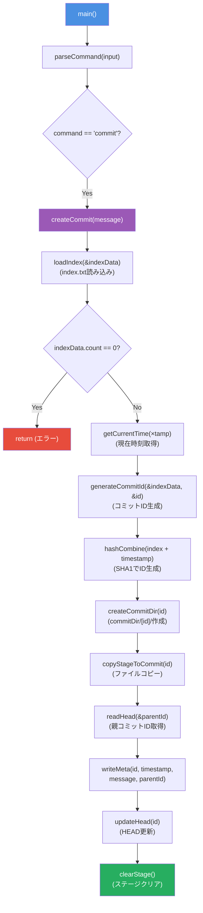
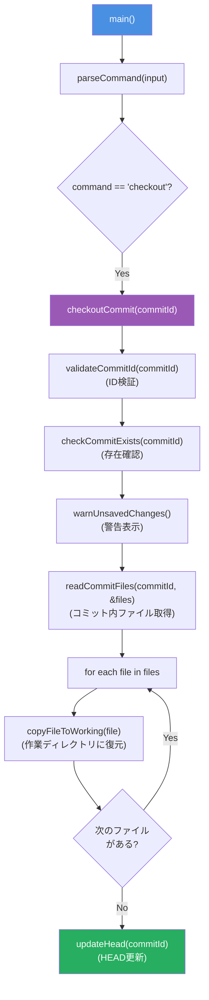

# C4 Model 設計書 - ローカル型バージョン管理システム

## Level 1: System Context Diagram (システムコンテキスト図)



### 概要
- **システム名**: ローカル型バージョン管理システム (Local VCS)
- **目的**: ファイルの変更履歴をローカルで管理し、任意の時点に復元可能にする
- **スコープ**: 単一マシン、単一ユーザー向け
- **除外機能**: リモート連携、ブランチ、マージ

### 外部アクター
1. **開発者 (Developer/User)**
   - コマンドラインインターフェースを通じてシステムを操作
   - ファイルをステージング、コミット、履歴参照、復元を実行

2. **ファイルシステム (File System)**
   - 作業ディレクトリのファイル
   - リポジトリデータ(.vcs/配下)
   - システムはファイルシステムに対して読み書きを実行

---

## Level 2: Container Diagram (コンテナ図)



### コンテナの説明

#### 1. CLI Interface (C言語実行ファイル)
- **技術**: C言語、stdio
- **責務**: ユーザーからのコマンドを受け取り、適切なマネージャーに処理を委譲
- **入力**: 標準入力からのコマンド文字列
- **出力**: 標準出力への結果表示

#### 2. Repository Manager
- **責務**: リポジトリの初期化と状態管理
- **主要関数**:
  - `initRepository()`: .vcs/ディレクトリ構造を作成
  - `getStatus()`: 現在のリポジトリ状態を取得

#### 3. Staging Manager
- **責務**: ステージングエリアの管理
- **主要関数**:
  - `addFile()`: ファイルをステージングエリアに追加
  - `updateIndex()`: index.txtの更新
  - `listStaged()`: ステージされたファイル一覧

#### 4. Commit Manager
- **責務**: コミットの作成、履歴管理、復元
- **主要関数**:
  - `createCommit()`: 新規コミット作成
  - `listCommits()`: コミット履歴表示
  - `checkoutCommit()`: 指定コミットに復元

#### 5. Core Services
- **Hash Service**: SHA1ハッシュ生成 (OpenSSL使用)
- **File Operations Service**: ファイルコピー、読み書き

#### 6. Data Storage
- **stageDir/**: ステージされたファイルとインデックス
- **commitDir/**: コミット履歴とスナップショット
- **Working Directory**: ユーザーの作業ディレクトリ

---

## Level 3: Component Diagram (コンポーネント図)

### Component: Commit Manager の詳細

```mermaid
graph TB
    subgraph CommitManager["Commit Manager"]
        Creator["Commit Creator"]
        Reader["History Reader"]
        Checkout["Checkout Handler"]
        Diff["Diff Analyzer (Optional)"]
    end

    subgraph CreatorFlow["Commit Creator Process"]
        C1["1. stageDirから<br/>ファイル一覧取得"]
        C2["2. タイムスタンプ生成"]
        C3["3. コミットID生成<br/>(SHA1)"]
        C4["4. comitDir/[ID]/<br/>ディレクトリ作成"]
        C5["5. ファイルを<br/>コミットDirにコピー"]
        C6["6. meta.txt作成"]
        C7["7. HEAD.txt更新"]

        C1 --> C2 --> C3 --> C4 --> C5 --> C6 --> C7
    end

    subgraph ReaderFlow["History Reader Process"]
        R1["1. comitDir/を走査"]
        R2["2. 各コミットの<br/>meta.txt読み込み"]
        R3["3. コミット情報を<br/>構造体に格納"]
        R4["4. 時系列順にソート"]
        R5["5. 標準出力に<br/>フォーマット表示"]

        R1 --> R2 --> R3 --> R4 --> R5
    end

    subgraph CheckoutFlow["Checkout Handler Process"]
        CH1["1. コミットID検証"]
        CH2["2. comitDir/[ID]/<br/>存在確認"]
        CH3["3. 作業ディレクトリの<br/>バックアップ警告"]
        CH4["4. コミット内ファイルを<br/>作業Dirに復元"]
        CH5["5. HEAD.txt更新"]

        CH1 --> CH2 --> CH3 --> CH4 --> CH5
    end

    subgraph DiffFlow["Diff Analyzer Process"]
        D1["1. 2つのコミットID<br/>を受け取り"]
        D2["2. 各コミットの<br/>ファイル一覧取得"]
        D3["3. ファイル名と<br/>ハッシュを比較"]
        D4["4. 追加/削除/変更<br/>を判定"]
        D5["5. 差分サマリー表示"]

        D1 --> D2 --> D3 --> D4 --> D5
    end

    Creator -.-> CreatorFlow
    Reader -.-> ReaderFlow
    Checkout -.-> CheckoutFlow
    Diff -.-> DiffFlow

    style CommitManager fill:#9B59B6,stroke:#6C3A80,stroke-width:3px,color:#fff
    style CreatorFlow fill:#E8F5E9,stroke:#4CAF50,stroke-width:2px
    style ReaderFlow fill:#E3F2FD,stroke:#2196F3,stroke-width:2px
    style CheckoutFlow fill:#FFF3E0,stroke:#FF9800,stroke-width:2px
    style DiffFlow fill:#FCE4EC,stroke:#E91E63,stroke-width:2px
```



### データ構造

```c
// コミット情報構造体
typedef struct {
    char commitId[9];           // コミットID (8文字 + null)
    char timestamp[20];         // YYYY-MM-DD HH:MM:SS
    char message[256];          // コミットメッセージ
    char parent[9];             // 親コミットID ("none" or ID)
} CommitInfo;

// ステージファイル情報
typedef struct {
    char filepath[256];         // ファイルパス
    char hash[41];              // SHA1ハッシュ (40文字 + null)
} StagedFile;

// インデックス管理
typedef struct {
    StagedFile* files;          // 動的配列
    int count;                  // ファイル数
} IndexData;
```

---

## Level 4: Code Diagram (コード図)

### 主要関数の呼び出しフロー

#### addコマンドの実装フロー


#### commitコマンドの実装フロー


#### checkoutコマンドの実装フロー


### ファイルI/O詳細

#### index.txtフォーマット
```
src/main.c 5d41402abc4b2a76b9719d911017c592a1b2c933
src/utils.c 7c211433f02071597741e6ff5a8ea34789abbf43
```

#### meta.txtフォーマット
```
timestamp: 2025-12-04 15:30:45
message: 初回コミット
parent: none
```

#### HEAD.txtフォーマット
```
a3f5c892
```

### エラーハンドリング戦略

```c
// 戻り値による成功/失敗判定
typedef enum {
    VCS_SUCCESS = 0,
    VCS_ERR_FILE_NOT_FOUND = 1,
    VCS_ERR_PERMISSION_DENIED = 2,
    VCS_ERR_INVALID_REPO = 3,
    VCS_ERR_NO_STAGED_FILES = 4,
    VCS_ERR_COMMIT_NOT_FOUND = 5,
    VCS_ERR_HASH_FAILURE = 6
} VcsErrorCode;

// 使用例
VcsErrorCode result = addFile(filepath);
if (result != VCS_SUCCESS) {
    printError(result);
    return;
}
```

---

## 実装優先順位

### Phase 1: 基盤整備
1. エラーコード定義
2. データ構造体定義
3. `hashGen`のバグ修正
4. ファイルコピー関数実装
5. コマンドパーサー実装

### Phase 2: コア機能
1. `addFile`実装
2. `updateIndex`実装
3. `createCommit`実装
4. `updateHead`実装

### Phase 3: 参照機能
1. `listCommits` (log)実装
2. `getStatus`実装
3. `checkoutCommit`実装

### Phase 4: 拡張機能
1. `diffAnalyzer`実装
2. エラーハンドリング強化
3. ヘルプメッセージ

---

## 非機能要件

### パフォーマンス
- **ハッシュ計算**: 4KBバッファで効率的読み込み
- **ファイルコピー**: バッファリングI/O使用
- **ターゲット**: 100MBファイルを10秒以内にコミット

### 信頼性
- **データ整合性**: SHA1ハッシュによる検証
- **アトミック性**: コミット作成は全て成功するか全て失敗
- **エラー回復**: 途中失敗時は部分的に作成されたファイルを削除

### 保守性
- **関数サイズ**: 50行以内を目標
- **コメント**: 各関数に目的と引数の説明を記載
- **命名規則**: キャメルケース、動詞+名詞

### セキュリティ
- **バッファオーバーフロー対策**: `snprintf`, `strncpy`使用
- **パス検証**: `..`を含むパスを拒否
- **権限チェック**: ファイル操作前に権限確認

---

## 技術的決定事項 (ADR)

### ADR-001: OpenSSL SHA1の採用
- **決定**: OpenSSL/libcrypto のSHA1を使用
- **理由**: 標準的で信頼性が高い、クロスプラットフォーム
- **代替案**: Windows CryptoAPI, 自前実装
- **影響**: OpenSSLへの依存が発生

### ADR-002: テキストベースのメタデータ
- **決定**: meta.txt, index.txt等をプレーンテキストで保存
- **理由**: 可読性、デバッグ容易性
- **代替案**: バイナリ形式、SQLite
- **影響**: パース処理が必要、大規模データには非効率

### ADR-003: コミットID短縮
- **決定**: SHA1の最初の8文字のみ使用
- **理由**: 衝突リスクは教育用途では許容範囲、可読性向上
- **代替案**: 完全な40文字使用
- **影響**: 理論上の衝突可能性(16^8 = 約43億通り)

### ADR-004: スナップショット方式
- **決定**: 各コミットで全ファイルをコピー(差分ではなく)
- **理由**: 実装がシンプル、復元が高速
- **代替案**: 差分(delta)方式
- **影響**: ストレージ使用量増加

---

## テスト戦略

### 単体テスト
- `hashGen`: 同一ファイルで同一ハッシュ生成確認
- `copyFile`: コピー後のハッシュ一致確認
- `parseCommand`: 各種コマンド文字列のパース確認

### 統合テスト
- init → add → commit → logの一連フロー
- commit → checkout → 作業ディレクトリ復元確認
- 複数回のcommit → log表示確認

### エッジケーステスト
- 空ファイルのadd/commit
- 非常に大きなファイル(1GB)のadd
- 特殊文字を含むファイル名
- 存在しないコミットIDへのcheckout

---

## 将来拡張の可能性

### 優先度: 中
- ファイル削除の追跡
- `.vcsignore`による除外機能
- コミットメッセージの編集

### 優先度: 低
- 簡易ブランチ機能(名前付きHEAD)
- タグ機能
- ファイル圧縮(zlib)

### 優先度: 将来
- GUI実装
- ネットワーク同期
- マージ機能

---

この設計書に基づいて実装を進めることで、段階的に機能を追加できます。
